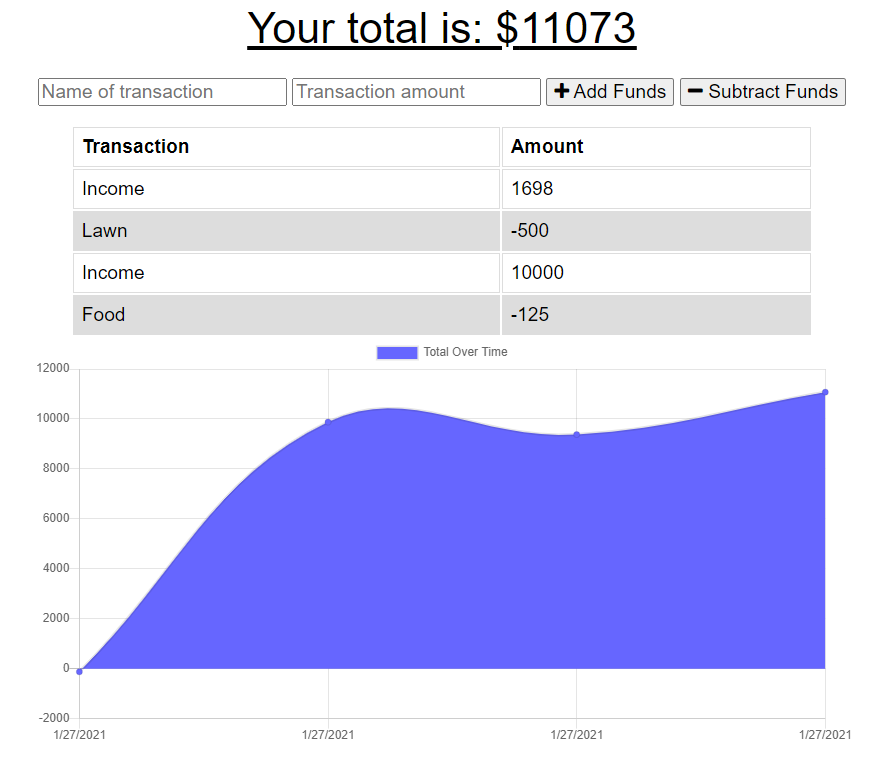

# Budget Tracker  
This is a Progressive Web Apllicaiton that is a budget tracker with offline access and finctionality. The user is able to add expenses and deposits to their budget with or without a connection. When entering transactions offline, they populate the total when brought back online.

Offline Functionality:

  * Enter deposits offline

  * Enter expenses offline

When brought back online:

  * Offline entries should be added to tracker.

<p align="center">
    
</p>

## Table of Contents:
* [Installation](#installation)
* [Usage](#usage)
* [License](#license)
* [Contributing](#contributing)
* [Tests](#tests)
* [Questions](#questions)
### Installation:
In order to install the necessary dependencies, open the console and run the following:
```npm install```
### Usage:
Enter the name of the transaction, the amount, and select "Add Funds" or "Subtract Funds". Watch the budget items populate below along with a visual graph of your budget history. 

<p align="center">
    
</p>

### License:
This project is licensed under:
MIT
### Contributing:
Contributions are welcome. Please sumbit contributions via email for approval and integration. 
### Tests:
In order to test open the console and run the following:
```npm test```
### Questions:
If you have any questions contact me on [GitHub](https://github.com/sambishop3015) or contact 
Sam Bishop	 at sambishop3015@hotmail.com

        
